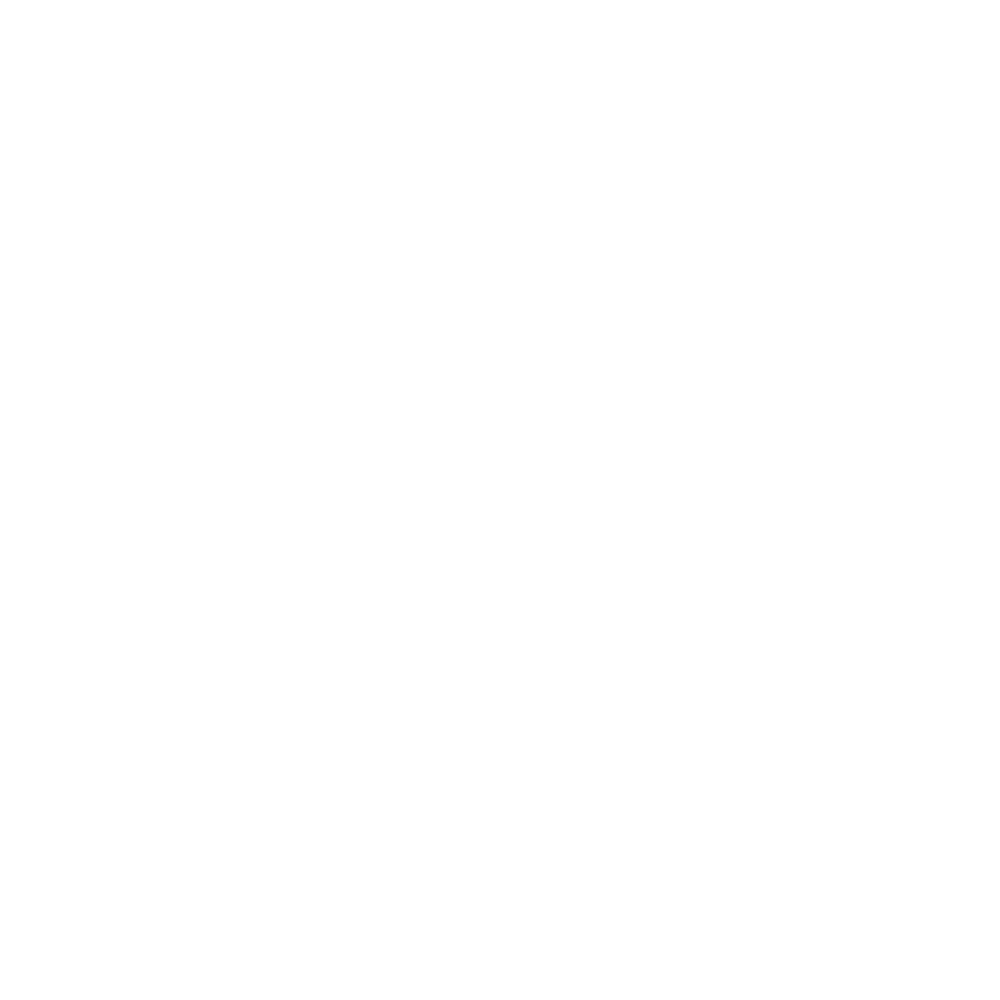

# EcoSprout: Mini Farm
Welcome to the magical world of EcoSprout, where farming is not just a chore but an adventure! Dive into our Mini Farm, a place where each seed holds the promise of growth and each harvest tells a story of perseverance.

## 🌱 Inspiration

In a world where concrete jungles are overtaking green pastures, EcoSprout was born out of a dream to reconnect people with nature. Our inspiration stems from the simple joy of planting a seed and watching it grow. We wanted to create a virtual farm where players of all ages can experience the wonder of farming, learn about sustainable practices, and have a ton of fun along the way!

## 🌾 What it does

*EcoSprout: Mini Farm* is an interactive, online farming game that allows players to cultivate crops, manage resources, and build their own little slice of paradise. Whether you're a single player looking for a serene farming experience or a double player ready for some friendly farming competition, EcoSprout has got you covered!

## 🛠 How we built it

Our farm was brought to life using the power of React, sprinkled with CSS magic for that extra visual flair. Each component was carefully cultivated, from the fields where crops grow to the market where you can sell your harvest. The weather system adds an extra layer of realism, making each farming decision impactful.

## 🚜 Challenges we ran into

Tilling the digital land wasn't without its challenges. We grappled with layout issues, battled bugs, and weathered the storm of debugging. For example, we had a hard time fixing the counter of our inventory to prevent it from decreasing the quantity by twice the amount of the consumption. But like any good farmer, we learned that patience and perseverance are the keys to a bountiful harvest.

## 🏆 Accomplishments that we're proud of

We're brimming with pride over our interactive crop selection, dynamic weather system, and user-friendly UI. We designed the double player gamemode like a brand new chess game where players have to make decision that can determine win or lose. We're also proud of our team's ability to work together and support each other through the ups and downs of the hackathon.

## 🌟 What we learned

Throughout this journey, we've learned that building a virtual farm is much like tending to a real one: it requires dedication, attention to detail, and a whole lot of love. We've also deepened our understanding of React and honed our problem-solving skills.

## 🌻 What's next for EcoSprout: Mini Farm

The future is bright and green for EcoSprout! We plan to introduce more crops, expand the marketplace, and integrate more sustainable farming practices. We're also exploring the idea of community events where players can come together and celebrate the joys of farming.

Join us in sowing the seeds of fun and growth. EcoSprout: Mini Farm - Where every sprout tells a story! 🌱

---

**Happy Farming!**

---

*Note to the user: You can replace placeholder texts like "path/to/logo.png" with actual paths or URLs to your resources.*
